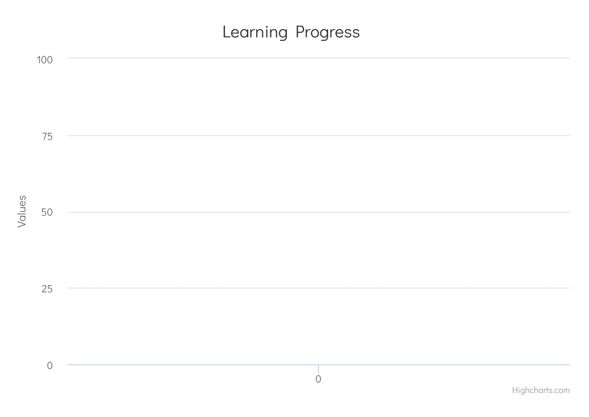
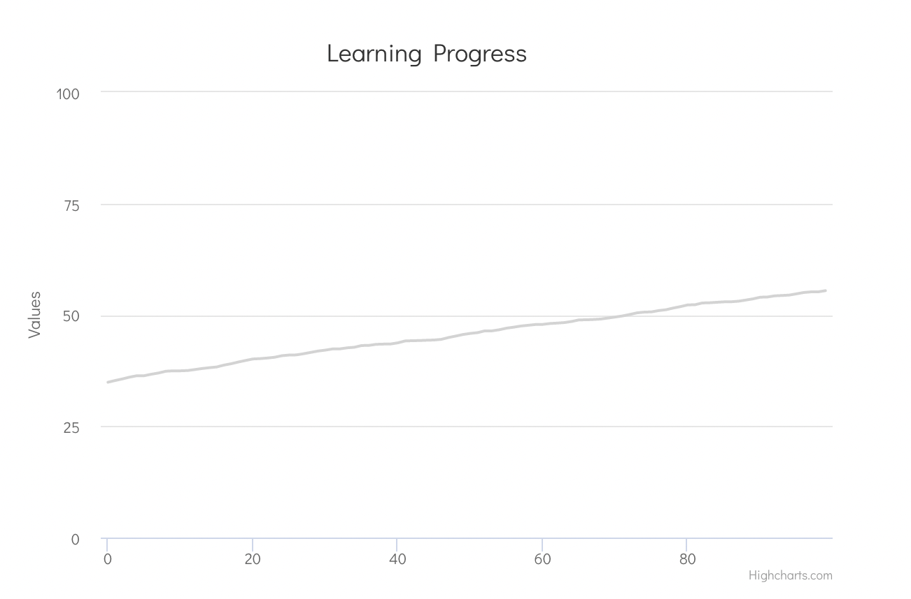
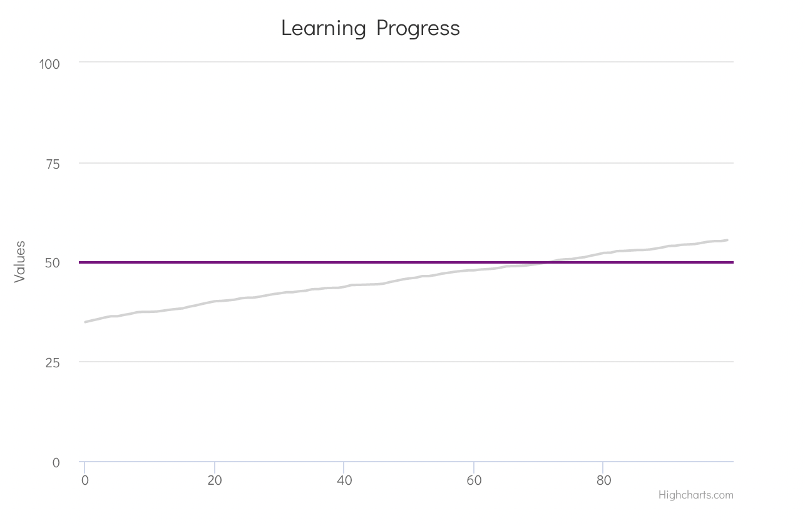
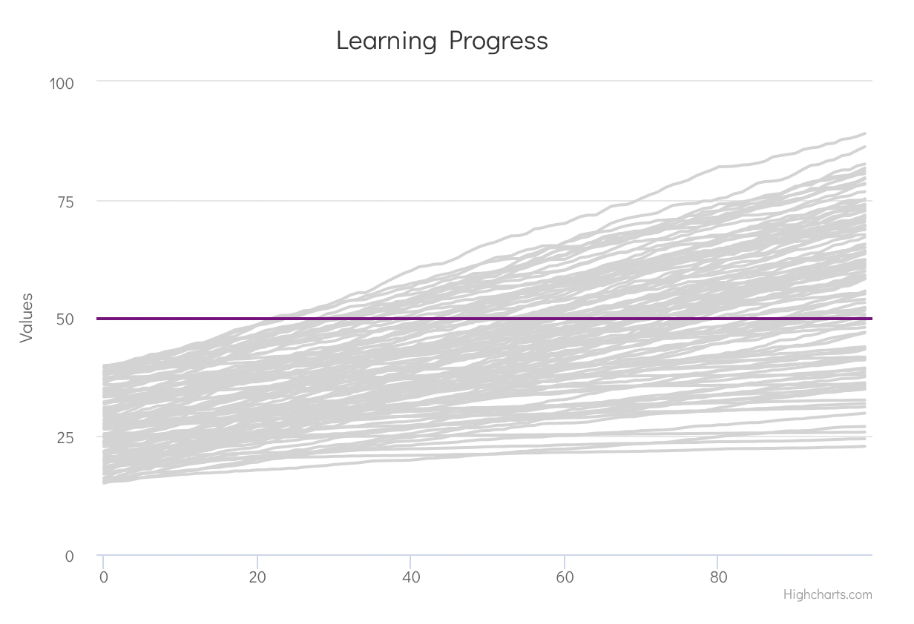
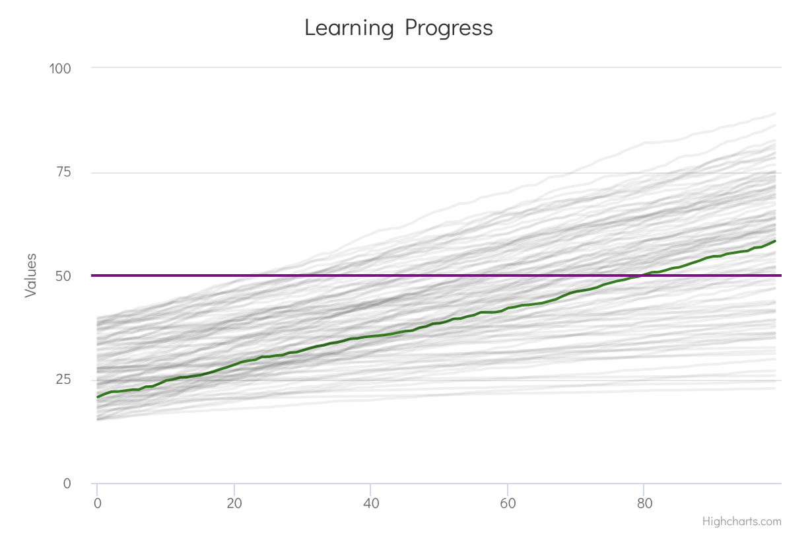
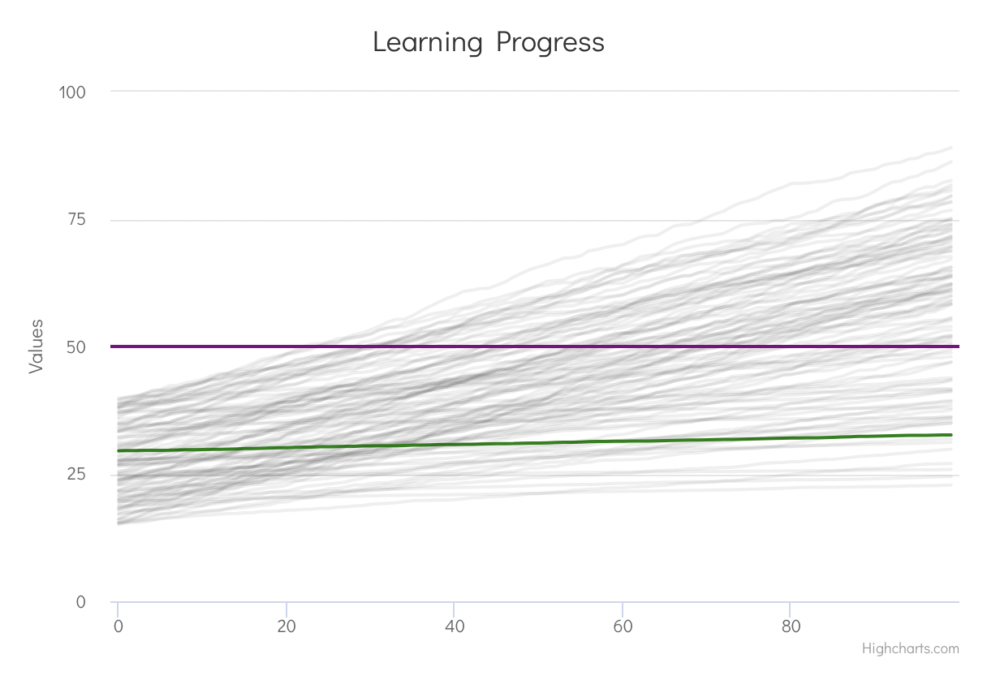

When students begin a course, they may have diverse degrees of knowledge and comprehension. 

And then as time goes by, they learn the concepts and improve their level of understanding.

A final grading exam is often conducted after the course to assess which students have attained a suitable level of comprehension. Those who score above a particular level are regarded to have finished the course satisfactorily.

The difficulty with this system is that it does not take into account individual student's learning experiences. 

As the course proceeds, it is not unusual for some students to study at a faster speed than others. Some students may even get "blocked," unable to understand the content.

Some students may fail to study because they lack prior knowledge, have learning difficulties, or are dealing with other personal issues. As they struggle to keep up with their peers, these student may feel disappointed.Furthermore, we can also have certain pupils being "blocked" and unable to learn. 

Therefore, it seems that the final grade of a student does not seem as useful as measuring the progress of the students throughout the course. This would enable to detect those cases and perform preventive actions to help those students.